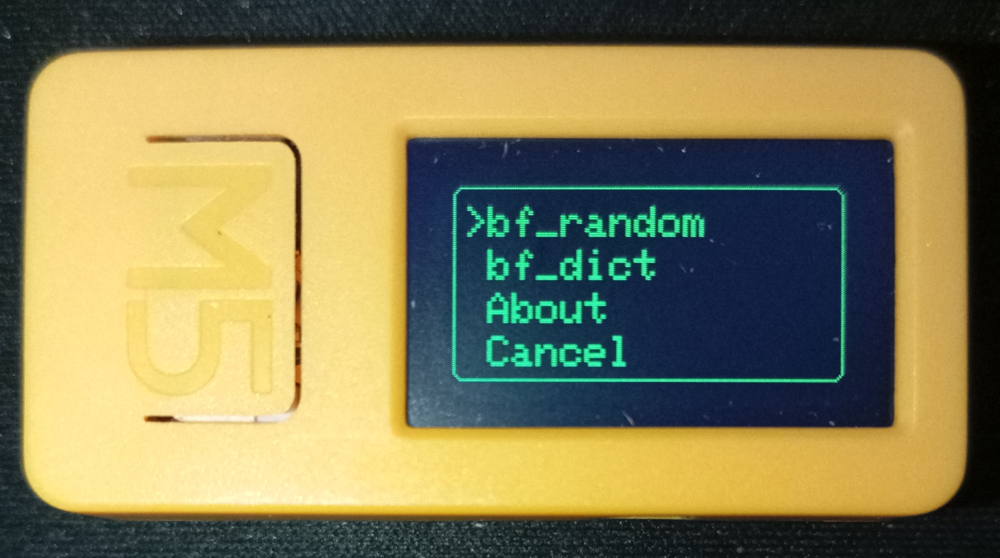
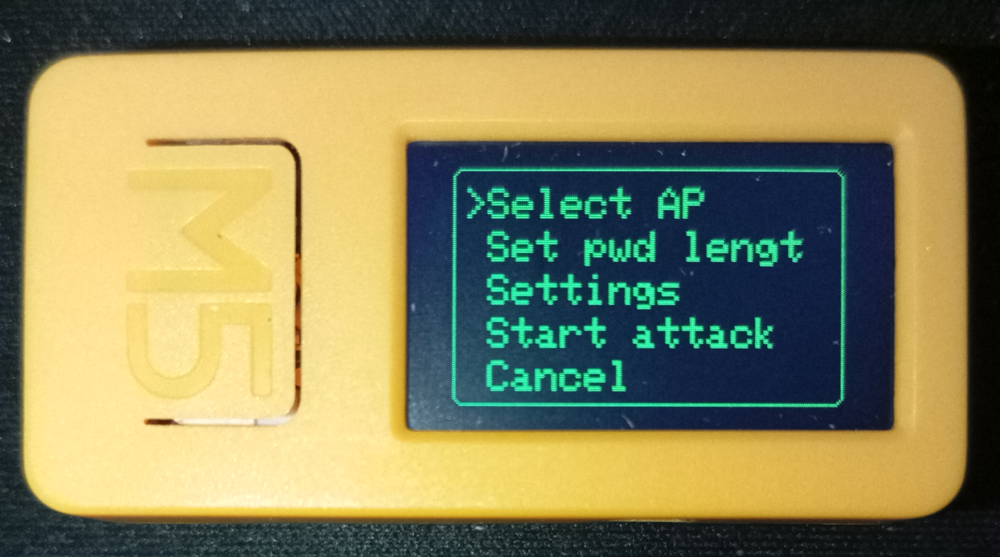
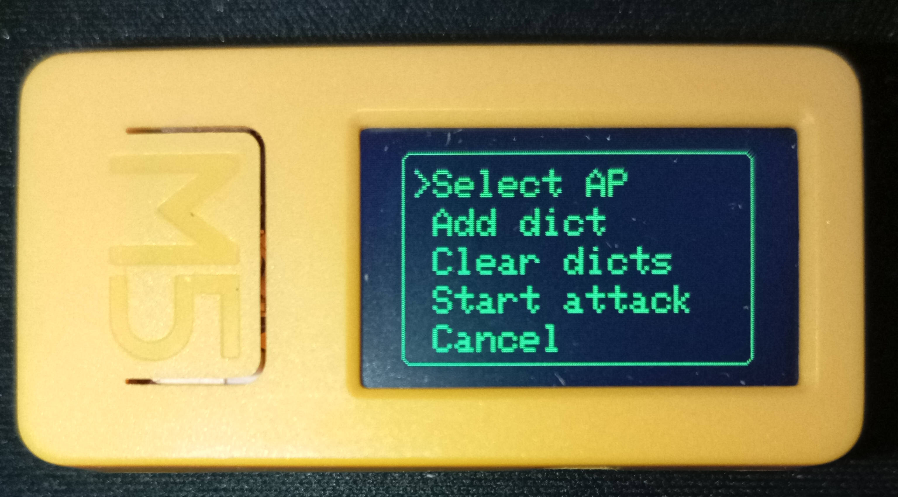
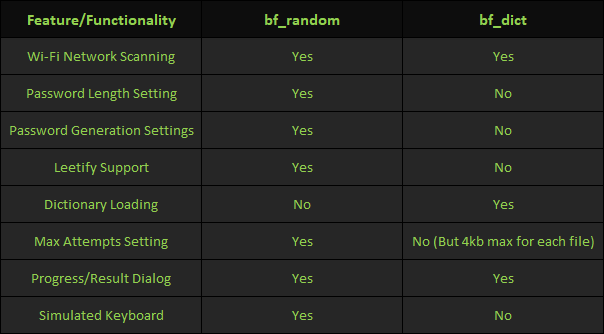

Wi-Fi Randomic Brute Force by DavideEDN 

(Language: JavaScript | Usage: JS Interpreter)

(Based on: https://github.com/pr3y/Bruce/blob/main/sd_files/interpreter/wifi_brute.js)

############################

Disclaimer: 

This tool is intended for ethical hacking and security auditing purposes only, specifically to test the security of Wi-Fi networks you own or have explicit permission to test. 

Unauthorized access to or attempts to compromise networks without explicit permission are illegal and unethical. 

The developer are not responsible for any misuse of this software. 

By using this tool, you agree to assume all responsibility and liability for your actions. 

It is your responsibility to comply with all applicable laws and regulations. If you are unsure whether your activities are legal, consult with legal counsel. 

Please, do not use this tool for any malicious or illegal purposes.

############################

General Features:

- Wi-Fi Network Scanning: Scans for available Wi-Fi networks (only WPA2_PSK and WEP) and lets the user select a target SSID.

- User Interface: All interactions are done via dialog boxes and a simulated keyboard.

- Settings Menu: Allows customization of password generation settings and maximum attempts.

- Progress Display: Shows current attempt, progress, and results/errors via dialogs.

- Leetify Function: Optionally "leetifies" passwords by replacing characters with visually similar symbols/numbers.

############################

bf_random Mode: Randomic Brute Force Attack

1. Network Selection

- Scan for Networks: User initiates a scan and selects a WPA2_PSK or WEP network to attack.

2. Password Length Configuration

- Set Password Length: User chooses the desired password length (between 5 and 20 characters).

3. Password Generation Settings

User can configure:

- Case Type: Random, first uppercase, all uppercase, all lowercase.

- Include Numbers: Yes/No.

- Only Numbers: Yes/No (forces numbers only, disables special chars and sets lowercase).

- Include Special Characters: Yes/No.

- Random Chars Position: Left, right, or mixed relative to the keyword.

- Keyword: User can set a keyword to include in passwords (which can be leetified).

- Show Keyword: Displays the current keyword.

- Max Attempts: Choose from preset values (10, 25, 50, 100, 250, 500, 750, 1000).

4. Attack Execution (Leetify Option: Before starting, user chooses whether to leetify the keyword.)

Password Generation: For each attempt, a new password is generated based on the settings:

- If a keyword is set, password = keyword (possibly leetified and cased) + random chars (side depends on setting).

- If no keyword, password is fully random.

Connection Attempt: The program tries to connect to the target Wi-Fi using the generated password.

Result Display:

- If successful, the correct password is shown.

- If unsuccessful after max attempts, an error message is displayed.

############################

bf_dict Mode: Dictionary Brute Force Attack

1. Network Selection

- Scan for Networks: User initiates a scan and selects a WPA2_PSK or WEP network to attack.

2. Dictionary Management

- Add Dictionary: User can load one or more password files (dictionaries) from storage.

- Clear Dictionaries: Option to remove all loaded dictionaries.

3. Attack Execution

Start Attack: The program iterates through all loaded dictionaries:

- For each password in the dictionaries, it attempts to connect to the selected Wi-Fi network.

- Progress is shown (current password number, dictionary file name).

Result Display:

- If a password works, it is shown as found and the process stops.

- If none work, an error is shown after all dictionaries are tried.

############################

Summary Table

With Love, DavideEDN
