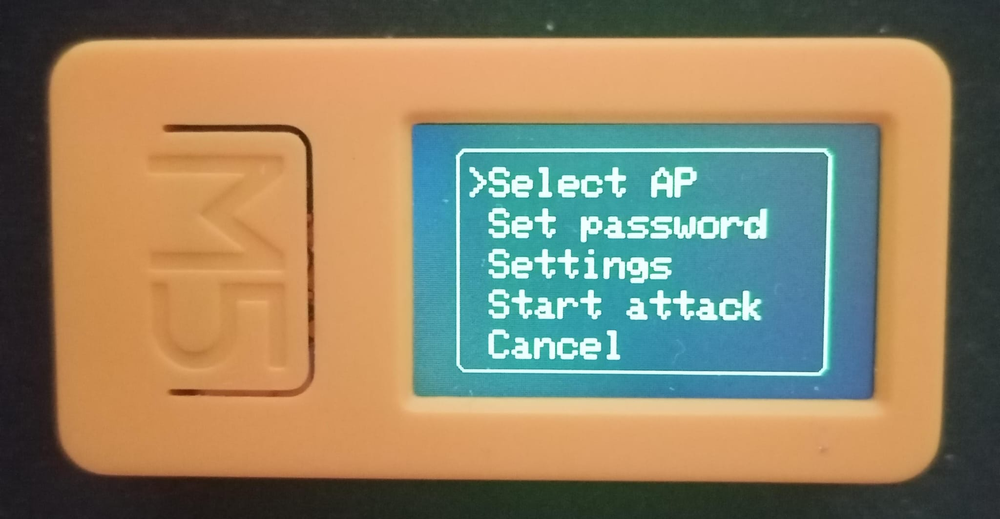

Wi-Fi Randomic Brute Force by DavideEDN 

(Language: JavaScript | Usage: JS Interpreter)

(Based on: https://github.com/pr3y/Bruce/blob/main/sd_files/interpreter/wifi_brute.js)

############################

Disclaimer: 

This tool is intended for ethical hacking and security auditing purposes only, specifically to test the security of Wi-Fi networks you own or have explicit permission to test. 

Unauthorized access to or attempts to compromise networks without explicit permission are illegal and unethical. 

The developer are not responsible for any misuse of this software. 

By using this tool, you agree to assume all responsibility and liability for your actions. 

It is your responsibility to comply with all applicable laws and regulations. If you are unsure whether your activities are legal, consult with legal counsel. 

Please, do not use this tool for any malicious or illegal purposes.

############################

Key Features:

- Wi-Fi Network Scanning: Scans for available Wi-Fi networks and allows the user to select a target network (SSID) to attack. It only supports WPA2_PSK and WEP networks.

Password Generation:

- Generates random passwords of a specified length, based on configurable settings.

- Supports different case types (random, first uppercase, all uppercase, all lowercase).

- Can include numbers and special characters in the generated passwords.

- Allows the user to define a keyword that will be included (and "leetified") in the generated passwords.

Brute-Force Attack:

- Attempts to connect to the selected Wi-Fi network by trying the generated passwords.

- Displays the progress and results of the attack on the screen using dialog boxes.

Settings Menu:

- Allows the user to customize the password generation settings (case type, include numbers, include special characters, keyword).

- Allows the user to set the maximum number of attempts.

User Interface:

- Uses dialog boxes and a simulated keyboard (implemented with dialog choices) for user interaction.

- "Leetifying" Passwords: Has a function to "leetify" passwords (replacing characters with numbers or symbols that look similar).

Workflow:

- The program scans for available Wi-Fi networks and presents them to the user.

- The user selects a target network to attack.

- The user sets the password length and configures the password generation settings.

- The program generates random passwords based on the settings and attempts to connect to the Wi-Fi network.

- If a password is found, it is displayed to the user. If no password is found after the maximum number of attempts, an error message is displayed.
